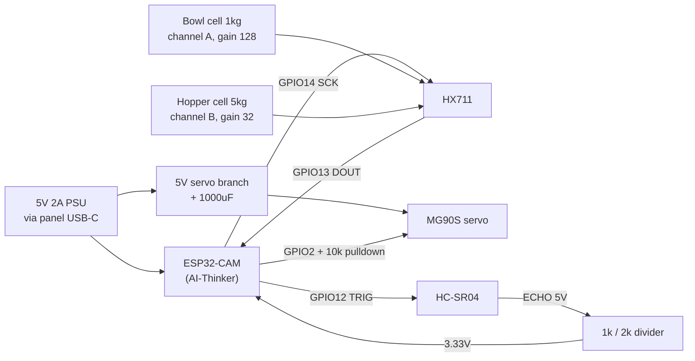

# Wiring

All grounds common. The divider is mandatory — see `pinout.md`.

## Load cell colours

Typical straight-bar cells (YZC-133 and similar):

| Wire | To HX711 |
|---|---|
| Red | E+ |
| Black | E− |
| White | A− (or B− for the hopper cell) |
| Green | A+ (or B+ for the hopper cell) |

Colours vary between suppliers. If a cell reads backwards, swap white and green
rather than rewiring anything else.

## The service loop

The servo mounts to the valve housing, which **floats on the hopper load cell**.
Its cable must reach the electronics bay without pulling on that assembly: leave
at least 80 mm of slack in a loop, and strain-relieve it **on the frame side
only**. A taut cable is a force path and will corrupt the hopper reading. See
`../ASSEMBLY.md`.
