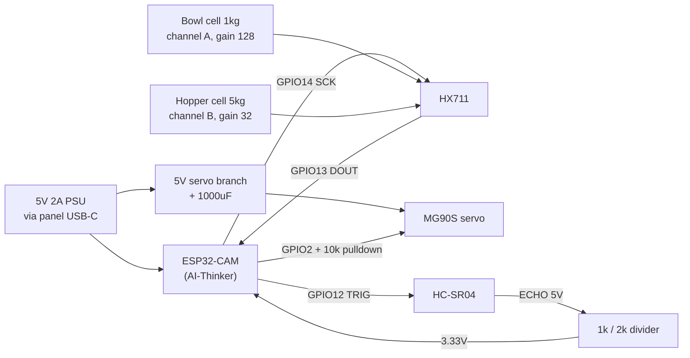

# Feeder Hardware Implementation Plan

> **For agentic workers:** REQUIRED SUB-SKILL: Use superpowers:subagent-driven-development (recommended) or superpowers:executing-plans to implement this plan task-by-task. Steps use checkbox (`- [ ]`) syntax for tracking.

**Goal:** Build the `design/` folder — nine parametric OpenSCAD parts, rendered STLs, electronics and assembly documentation — for the 3D-printed smart pet feeder, and align the dashboard's hopper capacity with the real machine.

**Architecture:** Every dimension lives in `design/scad/common.scad` as a named variable; each part file `include`s it and derives its geometry. Verification is compile-plus-assert: `common.scad` carries `assert()` calls for the properties that silently ruin a print (bed fit, positive clearances, hopper taper, pocket volume vs. grams-per-sweep), so a bad parameter fails the render rather than producing a quietly wrong part. `design/check.sh` renders every part headlessly and returns non-zero on any failure.

**Tech Stack:** OpenSCAD (2021.01+, `assert()` and `linear_extrude(scale=)` required), bash, and a one-line TypeScript change in the existing Next.js app.

**Spec:** `docs/superpowers/specs/2026-08-24-feeder-hardware-design.md`

## Global Constraints

- Bed envelope is **220 × 220 × 250 mm**. Every part must fit unsplit; `common.scad` asserts it.
- Dry kibble bulk density is **0.40 g/cm³**. Every gram figure derives from this constant, never hardcoded.
- Hopper is **2.0 L ≈ 800 g**. `CONFIG.hopperCapacityG` becomes **800**.
- Drum is **50 mm × 60 mm** with **0.4 mm radial clearance** (bore 50.8 mm).
- Pocket target is **≈8 g per sweep**; grams is *derived from geometry*, never asserted into existence.
- Pin map is fixed: HX711 SCK **14**, DOUT **13**, HC-SR04 TRIG **12**, ECHO **15**, servo **2**, flash LED **4**.
- HC-SR04 ECHO needs a **1 kΩ / 2 kΩ divider**. Servo needs a **separate 5 V branch + 1000 µF**.
- No part of the design may claim to be tested on hardware. Docs state plainly that it is unprinted.
- The bowl is **bought, not printed** (FDM is not food-safe long term).
- Existing app gates must stay green: `npm test`, `npm run typecheck`, `npm run lint`, `npm run build`.
- Commit at the end of every task.

---

### Task 1: Parametric core and the verification harness

Everything else depends on this. It is the only task that can fail in a way that invalidates all the others, so it ships first and ships with its own tests.

**Files:**
- Create: `design/scad/common.scad`
- Create: `design/check.sh`
- Create: `design/render.sh`
- Create: `design/.gitignore`

**Interfaces:**
- Consumes: nothing.
- Produces: every variable and helper the part files use — `wall`, `fit_slide`, `fit_press`, `bed_x/y/z`, `kibble_density`, `hopper_mouth`, `hopper_throat`, `hopper_h`, `hopper_wall_angle`, `drum_dia`, `drum_len`, `drum_bore`, `pocket_depth`, `sweep_grams`, `housing_x/y/z`, `outlet_x/y`, `chute_forward`, `chute_drop`, `chute_exit`, `bowl_dia`, `platform_dia`, `platform_t`, `base_size`, `tower_h`, `m3_free`, `m3_tap`, `cell_l`, `cell_bolt_spacing`, and `module frustum(bottom, top, h)`.

- [ ] **Step 1: Write `design/scad/common.scad`**

```scad
// common.scad — every dimension in the feeder lives here.
// Change a value, re-run ../check.sh, and every part regrows together.

/* ---------- Printer envelope ---------- */
bed_x = 220;
bed_y = 220;
bed_z = 250;

/* ---------- Material and process ---------- */
wall      = 2.0;    // nominal wall thickness (5 perimeters at 0.4 nozzle)
fit_slide = 0.30;   // clearance for parts that must move against each other
fit_press = 0.15;   // clearance for parts pressed together
$fn       = 96;

/* ---------- Fasteners ---------- */
m3_free = 3.4;      // M3 clearance hole
m3_tap  = 2.8;      // M3 self-tapping into plastic
m4_free = 4.5;

/* ---------- Load cells (VERIFY against the cells you actually buy) ----------
   Figures below are for the common YZC-133 straight bar. Bolt spacing varies
   between suppliers; measure yours before printing the base or the platform. */
cell_l            = 80;
cell_w            = 12.7;
cell_h            = 12.7;
cell_bolt_spacing = 15;   // centre-to-centre, at each end
cell_gap          = 3;    // spacer thickness — the beam MUST be free to flex

/* ---------- Food model ---------- */
kibble_density = 0.40;   // g/cm^3, dry kibble bulk density

/* ---------- Hopper ---------- */
hopper_volume_l = 2.0;
hopper_mouth    = 140;   // inner, square, at the top
hopper_throat   = 55;    // inner, square, at the bottom

// Square frustum volume: V = h/3 * (A1 + A2 + sqrt(A1*A2))
// For squares sqrt(A1*A2) collapses to mouth*throat, so height is exact:
hopper_h = 3 * hopper_volume_l * 1000000 /
           (hopper_mouth*hopper_mouth + hopper_throat*hopper_throat +
            hopper_mouth*hopper_throat);

hopper_run        = (hopper_mouth - hopper_throat) / 2;
hopper_wall_angle = atan(hopper_h / hopper_run);   // from horizontal
hopper_taper_rate = (hopper_mouth - hopper_throat) / hopper_h;
hopper_capacity_g = hopper_volume_l * 1000 * kibble_density;

/* ---------- Drum valve ---------- */
drum_dia       = 50;
drum_len       = 60;
drum_clearance = 0.4;                      // radial
drum_bore      = drum_dia + 2*drum_clearance;
pocket_depth   = 11.3;                     // segment depth of the scoop
shaft_dia      = 6;
shaft_len      = 8;

// Circular-segment maths. OpenSCAD trig is in DEGREES; the segment area
// formula needs the angle in RADIANS, hence the two forms below.
drum_r          = drum_dia / 2;
pocket_theta    = 2 * acos(1 - pocket_depth/drum_r);        // degrees
pocket_theta_r  = pocket_theta * PI / 180;                  // radians
pocket_area     = drum_r*drum_r/2 * (pocket_theta_r - sin(pocket_theta));
pocket_volume   = pocket_area * drum_len;                   // mm^3
sweep_grams     = pocket_volume / 1000 * kibble_density;    // DERIVED, not assumed

/* ---------- Valve housing ---------- */
housing_x = drum_len + 4*wall;      // along the drum axis
housing_y = drum_bore + 4*wall;
housing_z = drum_bore + 4*wall;
outlet_x  = 45;
outlet_y  = 45;

/* ---------- Chute ---------- */
chute_forward = 70;    // how far forward of the tower the food lands
chute_drop    = 90;    // vertical fall from valve outlet to chute exit
chute_exit    = 40;
chute_clear   = 40;    // exit height above the bowl rim — impulse, not load

/* ---------- Bowl and platform ---------- */
bowl_dia     = 140;    // the BOUGHT stainless/ceramic bowl
platform_dia = 150;
platform_t   = 5;
ring_w       = 3;
ring_h       = 8;
bowl_gap     = 6;      // air on every side — the isolation gap

/* ---------- Base and tower ---------- */
base_size = 190;
base_t    = 6;
bay_h     = 28;        // electronics bay height
tower_w   = 90;
tower_d   = 70;
tower_h   = 150;

/* ---------- Head ---------- */
head_tilt   = 30;      // camera, degrees down from horizontal
cam_pcb     = [40, 40, 1.6];
sr04_dia    = 16;
sr04_pitch  = 26;      // centre-to-centre of the two transducers

/* ---------- Derived overall ---------- */
total_h = base_t + bay_h + tower_h + housing_z + hopper_h;

/* ---------- Assertions: the things that silently ruin a print ---------- */
assert(hopper_wall_angle >= 60,
       str("Hopper wall ", hopper_wall_angle, " deg is below 60 - kibble will bridge"));
assert(hopper_h + 2*wall <= bed_z,
       str("Hopper ", hopper_h, " mm exceeds bed Z ", bed_z));
assert(hopper_mouth + 2*wall <= bed_x,
       "Hopper mouth exceeds bed X");
assert(base_size <= bed_x && base_size <= bed_y,
       "Base exceeds bed footprint");
assert(platform_dia <= bed_x, "Bowl platform exceeds bed X");
assert(drum_clearance > 0, "Drum clearance must be positive or the drum seizes");
assert(drum_bore > drum_dia, "Drum bore must exceed drum diameter");
assert(pocket_depth < drum_r,
       "Pocket deeper than the drum radius - the scoop would cut through the axis");
assert(sweep_grams > 6 && sweep_grams < 10,
       str("Sweep delivers ", sweep_grams, " g - outside the 6-10 g design window"));
assert(platform_dia + 2*bowl_gap < base_size + 2*chute_forward,
       "Bowl platform does not fit the base arm");
assert(bowl_gap > 0, "Bowl isolation gap must be positive");
assert(cell_gap > 0, "Load cell needs a flex gap or it reads nothing");

/* ---------- Shared geometry ---------- */
// A square frustum, bottom face on the XY plane, centred on Z.
module frustum(bottom, top, h) {
  linear_extrude(height = h, scale = top/bottom)
    square([bottom, bottom], center = true);
}

// A rectangular tube used for the labyrinth lip on the lid and hopper mouth.
module lip(inner, thickness, h) {
  difference() {
    cube([inner + 2*thickness, inner + 2*thickness, h], center = true);
    cube([inner, inner, h + 1], center = true);
  }
}

// Four bolt holes on a square pattern.
module bolt_square(spacing, dia, h) {
  for (i = [0:3])
    rotate([0, 0, 90*i])
      translate([spacing/2, spacing/2, 0])
        cylinder(d = dia, h = h, center = true, $fn = 24);
}

// The cantilever footprint a load cell bolts into: two holes plus a relief slot.
module cell_mount(dia = m3_tap, h = 10) {
  for (y = [-cell_bolt_spacing/2, cell_bolt_spacing/2])
    translate([0, y, 0]) cylinder(d = dia, h = h, center = true, $fn = 24);
}

echo(str("hopper_h = ", hopper_h, " mm"));
echo(str("hopper wall angle = ", hopper_wall_angle, " deg"));
echo(str("hopper capacity = ", hopper_capacity_g, " g"));
echo(str("sweep = ", sweep_grams, " g"));
echo(str("total height = ", total_h, " mm"));
```

- [ ] **Step 2: Write `design/check.sh`**

```bash
#!/usr/bin/env bash
# Compile every part headlessly. Any assert() failure or syntax error exits non-zero.
set -uo pipefail
cd "$(dirname "$0")"

OPENSCAD="${OPENSCAD:-}"
if [ -z "$OPENSCAD" ]; then
  if command -v openscad >/dev/null 2>&1; then
    OPENSCAD=openscad
  elif [ -x /Applications/OpenSCAD.app/Contents/MacOS/OpenSCAD ]; then
    OPENSCAD=/Applications/OpenSCAD.app/Contents/MacOS/OpenSCAD
  else
    echo "OpenSCAD not found. Install it, or set OPENSCAD=/path/to/openscad" >&2
    exit 127
  fi
fi

tmp=$(mktemp -d)
trap 'rm -rf "$tmp"' EXIT
fail=0

for f in scad/*.scad; do
  name=$(basename "$f" .scad)
  [ "$name" = "common" ] && continue
  if out=$("$OPENSCAD" --hardwarnings -o "$tmp/$name.stl" "$f" 2>&1); then
    printf '  ok    %s\n' "$name"
  else
    printf '  FAIL  %s\n' "$name"
    printf '%s\n' "$out" | sed 's/^/          /'
    fail=1
  fi
done

[ "$fail" -eq 0 ] && echo "all parts compile" || echo "one or more parts failed" >&2
exit "$fail"
```

- [ ] **Step 3: Write `design/render.sh`**

```bash
#!/usr/bin/env bash
# Render every printable part to design/stl/.
set -euo pipefail
cd "$(dirname "$0")"

OPENSCAD="${OPENSCAD:-}"
if [ -z "$OPENSCAD" ]; then
  if command -v openscad >/dev/null 2>&1; then
    OPENSCAD=openscad
  elif [ -x /Applications/OpenSCAD.app/Contents/MacOS/OpenSCAD ]; then
    OPENSCAD=/Applications/OpenSCAD.app/Contents/MacOS/OpenSCAD
  else
    echo "OpenSCAD not found. Install it, or set OPENSCAD=/path/to/openscad" >&2
    exit 127
  fi
fi

mkdir -p stl
for f in scad/*.scad; do
  name=$(basename "$f" .scad)
  case "$name" in common|plate-all) continue;; esac
  echo "rendering $name"
  "$OPENSCAD" -o "stl/$name.stl" "$f"
done
echo "STLs in design/stl/"
```

- [ ] **Step 4: Write `design/.gitignore`**

```
# Rendered output — regenerate with ./render.sh
stl/*.stl
```

- [ ] **Step 5: Make the scripts executable and prove the harness catches a bad parameter**

```bash
chmod +x design/check.sh design/render.sh
# Temporarily break the taper to prove the assertion fires:
sed -i '' 's/^hopper_throat   = 55;/hopper_throat   = 135;/' design/scad/common.scad
echo 'include <common.scad> module p(){cube(1);} p();' > design/scad/_probe.scad
./design/check.sh; echo "exit=$?"
```

Expected: `FAIL _probe`, an `Hopper wall ... is below 60` assertion message, and `exit=1`.

- [ ] **Step 6: Restore the parameter and confirm the harness passes**

```bash
sed -i '' 's/^hopper_throat   = 135;/hopper_throat   = 55;/' design/scad/common.scad
./design/check.sh; echo "exit=$?"
rm design/scad/_probe.scad
```

Expected: `ok _probe`, `all parts compile`, `exit=0`. Then the probe file is deleted.

- [ ] **Step 7: Verify the derived figures are the ones the spec claims**

```bash
OPENSCAD=${OPENSCAD:-openscad}; "$OPENSCAD" -o /dev/null design/scad/common.scad 2>&1 | grep ECHO
```

Expected, within rounding: `hopper_h ≈ 197.9`, `wall angle ≈ 77.9`, `capacity = 800`, `sweep ≈ 7.98`.
If `sweep_grams` has drifted outside 6–10 g the assertion in Step 1 already failed the build.

- [ ] **Step 8: Commit**

```bash
git add design/
git commit -m "Add parametric core and render harness for the feeder hardware"
```

---

### Task 2: Hopper and lid

**Files:**
- Create: `design/scad/hopper.scad`
- Create: `design/scad/lid.scad`

**Interfaces:**
- Consumes: `frustum()`, `lip()`, `bolt_square()`, `hopper_*`, `wall`, `m3_free` from `common.scad`.
- Produces: `module hopper()` and `module lid()`; the hopper's throat flange bolt circle is `hopper_throat + 2*wall + 12`, which Task 3's valve housing must match.

- [ ] **Step 1: Write `design/scad/hopper.scad`**

```scad
include <common.scad>

flange_w = 6;
flange_t = 4;
flange_bolts = hopper_throat + 2*wall + 12;

module hopper() {
  difference() {
    union() {
      // Outer shell.
      frustum(hopper_throat + 2*wall, hopper_mouth + 2*wall, hopper_h);
      // Throat flange — bolts onto the valve housing.
      translate([0, 0, -flange_t])
        cube([hopper_throat + 2*wall + 2*flange_w,
              hopper_throat + 2*wall + 2*flange_w, flange_t], center = false);
      // Mouth rim, thickened so the lid lip has something to seat against.
      translate([0, 0, hopper_h - 3])
        lip(hopper_mouth, wall + 1.5, 3);
    }

    // Food void. Extended 1 mm past each end so the boolean has no coincident
    // faces; the taper rate is applied so the throat and mouth stay exact.
    translate([0, 0, -flange_t - 1])
      frustum(hopper_throat - hopper_taper_rate * (flange_t + 1),
              hopper_mouth  + hopper_taper_rate,
              hopper_h + flange_t + 2);

    // Flange bolt holes.
    translate([0, 0, -flange_t/2])
      bolt_square(flange_bolts, m3_free, flange_t + 2);
  }
}

hopper();
```

The flange is drawn with `center = false` on purpose: `cube` centred in X/Y but not Z would need a translate anyway, and this keeps the flange's underside flush at `z = -flange_t`. Recentre it if a later fit check shows it offset.

- [ ] **Step 2: Write `design/scad/lid.scad`**

```scad
include <common.scad>

lid_t     = 3;
lid_over  = 4;                 // overhang past the hopper rim
lid_inner = hopper_mouth - fit_slide * 2;

module lid() {
  union() {
    // Top plate.
    translate([0, 0, 0])
      cube([hopper_mouth + 2*wall + 2*lid_over,
            hopper_mouth + 2*wall + 2*lid_over, lid_t], center = true);
    // Labyrinth lip that drops into the mouth — keeps humidity and paws out.
    translate([0, 0, -lid_t/2 - 5])
      lip(lid_inner - 2*wall, wall, 10);
    // Finger recess boss.
    translate([0, 0, lid_t/2])
      difference() {
        cylinder(d = 40, h = 6, $fn = 64);
        translate([0, 0, 2]) cylinder(d = 34, h = 6, $fn = 64);
      }
  }
}

lid();
```

- [ ] **Step 3: Compile both parts**

Run: `./design/check.sh`
Expected: `ok hopper`, `ok lid`, `all parts compile`, exit 0.

- [ ] **Step 4: Confirm the hopper fits the bed**

```bash
OPENSCAD=${OPENSCAD:-openscad}; "$OPENSCAD" -o /tmp/hopper.stl design/scad/hopper.scad 2>&1 | tail -3
python3 - <<'PY'
import struct
with open('/tmp/hopper.stl','rb') as f:
    f.read(80); n = struct.unpack('<I', f.read(4))[0]
    xs=[]; ys=[]; zs=[]
    for _ in range(n):
        f.read(12)
        for _ in range(3):
            x,y,z = struct.unpack('<3f', f.read(12)); xs.append(x); ys.append(y); zs.append(z)
        f.read(2)
print("bbox mm: X=%.1f Y=%.1f Z=%.1f" % (max(xs)-min(xs), max(ys)-min(ys), max(zs)-min(zs)))
PY
```

Expected: X and Y ≈ 144, Z ≈ 202 — inside 220 × 220 × 250.

- [ ] **Step 5: Commit**

```bash
git add design/scad/hopper.scad design/scad/lid.scad
git commit -m "Add parametric hopper and lid"
```

---

### Task 3: Drum and valve housing — the mechanism

This is the part that meters food. Get the pocket wrong and every portion is wrong.

**Files:**
- Create: `design/scad/drum.scad`
- Create: `design/scad/valve-housing.scad`

**Interfaces:**
- Consumes: `drum_*`, `pocket_depth`, `shaft_*`, `housing_*`, `outlet_*`, `hopper_throat`, `m3_free`, `m3_tap`.
- Produces: `module drum()` and `module valve_housing()`. The housing's top flange bolt circle matches Task 2's `flange_bolts`; its bottom outlet is `outlet_x × outlet_y`, which Task 4's chute mates to.

- [ ] **Step 1: Write `design/scad/drum.scad`**

```scad
include <common.scad>

horn_l = 20;    // servo horn arm length
horn_w = 5;
horn_t = 2;

module drum() {
  difference() {
    union() {
      // Drum body. Axis along Z here for printing; it mounts along X.
      cylinder(d = drum_dia, h = drum_len);
      // Idler shaft stub (far end from the servo).
      translate([0, 0, drum_len]) cylinder(d = shaft_dia, h = shaft_len, $fn = 48);
    }

    // The scoop pocket: a circular segment of depth pocket_depth, running the
    // full length. Everything with y > r - pocket_depth is removed.
    translate([-drum_dia/2 - 1, drum_r - pocket_depth, -1])
      cube([drum_dia + 2, pocket_depth + 2, drum_len + 2]);

    // Servo horn recess in the driven face, plus two M2 screw holes.
    translate([0, 0, -0.01]) {
      cube([horn_l, horn_w, 2*horn_t], center = true);
      cylinder(d = 8, h = 2*horn_t, center = true, $fn = 32);
      for (x = [-horn_l/2 + 3, horn_l/2 - 3])
        translate([x, 0, 0]) cylinder(d = 2.2, h = 4*horn_t, center = true, $fn = 20);
    }
  }
}

drum();
```

The pocket lips are left sharp by this geometry. Chamfer them in slicer or add a `minkowski` pass only if a print shows kibble catching — a chamfer here costs render time and is not worth it before the first print.

- [ ] **Step 2: Write `design/scad/valve-housing.scad`**

```scad
include <common.scad>

flange_w     = 6;
flange_t     = 4;
flange_bolts = hopper_throat + 2*wall + 12;
servo_body   = [23, 12.5, 22.5];    // SG90 / MG90S body
servo_lug    = 32;                  // lug hole centres

module valve_housing() {
  difference() {
    union() {
      cube([housing_x, housing_y, housing_z], center = true);
      // Top flange, bolts to the hopper throat.
      translate([0, 0, housing_z/2])
        cube([hopper_throat + 2*wall + 2*flange_w,
              hopper_throat + 2*wall + 2*flange_w, flange_t], center = true);
    }

    // Drum bore, axis along X.
    rotate([0, 90, 0])
      cylinder(d = drum_bore, h = housing_x + 2, center = true);

    // Inlet from the hopper — top half only, so the drum still seals at rest.
    translate([0, 0, housing_z/4 + flange_t/2])
      cube([hopper_throat, hopper_throat, housing_z/2 + flange_t + 1], center = true);

    // Outlet to the chute — bottom half only.
    translate([0, 0, -housing_z/4])
      cube([outlet_x, outlet_y, housing_z/2 + 1], center = true);

    // Flange bolt holes.
    translate([0, 0, housing_z/2 + flange_t/2])
      bolt_square(flange_bolts, m3_free, flange_t + 2);

    // Servo pocket in the +X wall. The servo mounts to THIS part, which
    // floats on the load cell. Never mount it to the tower.
    translate([housing_x/2 - servo_body[2]/2 + 1, 0, 0])
      cube(servo_body, center = true);
    for (y = [-servo_lug/2, servo_lug/2])
      translate([housing_x/2 - 6, y, 0])
        rotate([0, 90, 0]) cylinder(d = m3_tap, h = 14, center = true, $fn = 24);
  }
}

valve_housing();
```

- [ ] **Step 3: Compile**

Run: `./design/check.sh`
Expected: `ok drum`, `ok valve-housing`, exit 0.

- [ ] **Step 4: Verify the pocket delivers the grams the spec claims**

```bash
OPENSCAD=${OPENSCAD:-openscad}; "$OPENSCAD" -o /dev/null design/scad/drum.scad 2>&1 | grep "sweep"
```

Expected: `sweep = 7.9...` g. A 120 g portion is `120 / 7.98 ≈ 15` sweeps — the figure `ASSEMBLY.md` and the firmware both quote.

- [ ] **Step 5: Commit**

```bash
git add design/scad/drum.scad design/scad/valve-housing.scad
git commit -m "Add drum valve and housing with derived grams-per-sweep"
```

---

### Task 4: Chute and bowl platform — the isolation-critical pair

**Files:**
- Create: `design/scad/chute.scad`
- Create: `design/scad/bowl-platform.scad`

**Interfaces:**
- Consumes: `outlet_*`, `chute_*`, `bowl_dia`, `platform_*`, `ring_*`, `cell_*`, `m3_tap`.
- Produces: `module chute()` and `module bowl_platform()`. The platform's underside cell boss is what Task 5's base arm bolts to.

- [ ] **Step 1: Write `design/scad/chute.scad`**

```scad
include <common.scad>

skirt_h    = 12;
skirt_gap  = 6;    // the non-contact labyrinth gap around the floating assembly

module chute() {
  union() {
    difference() {
      // Outer funnel: outlet rectangle swept forward and down to the exit.
      hull() {
        cube([outlet_x + 2*wall, outlet_y + 2*wall, 1], center = true);
        translate([0, chute_forward, -chute_drop])
          cube([chute_exit + 2*wall, chute_exit + 2*wall, 1], center = true);
      }
      // Inner void, extended past both ends.
      hull() {
        translate([0, 0, 1]) cube([outlet_x, outlet_y, 1], center = true);
        translate([0, chute_forward, -chute_drop - 1])
          cube([chute_exit, chute_exit, 1], center = true);
      }
    }

    // Non-contact skirt. It overlaps the floating valve housing so kibble
    // cannot escape through the isolation gap. It MUST NOT TOUCH the housing —
    // skirt_gap is that promise expressed as geometry.
    translate([0, 0, skirt_h/2])
      lip(outlet_x + 2*wall + 2*skirt_gap, wall, skirt_h);
  }
}

chute();
```

- [ ] **Step 2: Write `design/scad/bowl-platform.scad`**

```scad
include <common.scad>

boss_l = cell_l * 0.45;
boss_w = cell_w + 2*wall;
boss_h = 14;

module bowl_platform() {
  difference() {
    union() {
      cylinder(d = platform_dia, h = platform_t);

      // Retaining ring that locates the bought bowl.
      translate([0, 0, platform_t])
        difference() {
          cylinder(d = bowl_dia + 2*ring_w + 2*fit_slide, h = ring_h);
          translate([0, 0, -1])
            cylinder(d = bowl_dia + 2*fit_slide, h = ring_h + 2);
        }

      // Cantilever boss on the underside — the ONLY thing that touches
      // anything else. The load cell bolts here; nothing else may.
      translate([0, -platform_dia/4, -boss_h])
        cube([boss_w, boss_l, boss_h], center = false);
    }

    // Load cell bolt holes through the boss.
    translate([boss_w/2, -platform_dia/4 + boss_l/2, -boss_h/2])
      rotate([0, 0, 90]) cell_mount(m3_tap, boss_h + 2);

    // Drain slots, so spilled water leaves the platform instead of sitting
    // on the cell.
    for (a = [0:60:359])
      rotate([0, 0, a]) translate([platform_dia/4, 0, -1])
        cube([20, 3, platform_t + 2], center = true);
  }
}

bowl_platform();
```

- [ ] **Step 3: Compile**

Run: `./design/check.sh`
Expected: `ok chute`, `ok bowl-platform`, exit 0.

- [ ] **Step 4: Commit**

```bash
git add design/scad/chute.scad design/scad/bowl-platform.scad
git commit -m "Add chute with non-contact skirt and isolated bowl platform"
```

---

### Task 5: Tower and base

**Files:**
- Create: `design/scad/tower.scad`
- Create: `design/scad/base.scad`

**Interfaces:**
- Consumes: `tower_*`, `base_*`, `bay_h`, `cell_*`, `platform_dia`, `bowl_gap`, `chute_forward`, `m3_tap`, `m3_free`.
- Produces: `module tower()` and `module base()`. The tower's cell anchor carries the floating hopper assembly; the base's forward arm carries the bowl platform.

- [ ] **Step 1: Write `design/scad/tower.scad`**

```scad
include <common.scad>

anchor_h = 20;

module tower() {
  difference() {
    union() {
      // Spine — an open C section, printed on its back, no supports needed.
      difference() {
        cube([tower_w, tower_d, tower_h], center = false);
        translate([wall, wall, -1])
          cube([tower_w - 2*wall, tower_d, tower_h + 2], center = false);
      }
      // Load cell anchor for the floating hopper assembly. The FRAME half of
      // the cantilever bolts here; the hopper half bolts to the valve housing.
      translate([tower_w/2 - (cell_w + 2*wall)/2, wall, tower_h - anchor_h])
        cube([cell_w + 2*wall, cell_l * 0.45, anchor_h], center = false);
    }

    // Cell bolt holes in the anchor.
    translate([tower_w/2, wall + cell_l*0.225, tower_h - anchor_h/2])
      cell_mount(m3_tap, cell_w + 2*wall + 2);

    // Cable routes: one for the servo service loop, one for the sensors.
    for (z = [tower_h*0.35, tower_h*0.65])
      translate([tower_w/2, tower_d/2, z])
        rotate([90, 0, 0]) cylinder(d = 12, h = tower_d + 2, center = true, $fn = 32);

    // Ultrasonic window on the front face.
    translate([tower_w/2, wall/2, tower_h*0.30])
      rotate([90, 0, 0])
        for (x = [-sr04_pitch/2, sr04_pitch/2])
          translate([x, 0, 0])
            cylinder(d = sr04_dia + fit_slide, h = wall + 2, center = true, $fn = 48);
  }
}

tower();
```

- [ ] **Step 2: Write `design/scad/base.scad`**

```scad
include <common.scad>

arm_w  = 60;
usb_w  = 10;
usb_h  = 5;

module base() {
  difference() {
    union() {
      // Main plate.
      cube([base_size, base_size, base_t], center = true);
      // Electronics bay walls.
      translate([0, 0, base_t/2 + bay_h/2])
        difference() {
          cube([base_size, base_size, bay_h], center = true);
          cube([base_size - 2*wall, base_size - 2*wall, bay_h + 1], center = true);
        }
      // Forward arm carrying the bowl platform's load cell.
      translate([0, -base_size/2 - chute_forward/2, 0])
        cube([arm_w, chute_forward, base_t], center = true);
    }

    // Load cell bolt holes at the arm tip.
    translate([0, -base_size/2 - chute_forward + cell_l*0.225, 0])
      cell_mount(m3_tap, base_t + 2);

    // USB-C panel cutout in the rear bay wall.
    translate([0, base_size/2 - wall/2, base_t/2 + bay_h/2])
      cube([usb_w, wall + 2, usb_h], center = true);

    // Ventilation for the bay.
    for (x = [-40:20:40])
      translate([x, -base_size/2 + wall/2, base_t/2 + bay_h/2])
        cube([4, wall + 2, bay_h * 0.6], center = true);

    // Tower mounting holes.
    translate([0, 40, 0]) bolt_square(60, m3_free, base_t + 2);
  }
}

base();
```

- [ ] **Step 3: Compile and check both fit the bed**

Run: `./design/check.sh`
Expected: `ok tower`, `ok base`, exit 0. The `base_size <= bed_x` assertion in `common.scad` already guards the footprint; the forward arm extends the printed envelope in Y, so confirm it explicitly:

```bash
OPENSCAD=${OPENSCAD:-openscad}; "$OPENSCAD" -o /tmp/base.stl design/scad/base.scad
python3 - <<'PY'
import struct
with open('/tmp/base.stl','rb') as f:
    f.read(80); n = struct.unpack('<I', f.read(4))[0]
    ys=[]
    for _ in range(n):
        f.read(12)
        for _ in range(3):
            x,y,z = struct.unpack('<3f', f.read(12)); ys.append(y)
        f.read(2)
print("base Y extent: %.1f mm" % (max(ys)-min(ys)))
PY
```

Expected: ≈ 260 mm, which **exceeds the 220 mm bed**. This is the expected outcome of Step 3 and is fixed in Step 4 — do not skip ahead.

- [ ] **Step 4: Split the arm into a separate bolted part**

The base plus its forward arm is 260 mm in Y and will not print. Make the arm a separate part that bolts to the base, and add the assertion that would have caught it.

Create `design/scad/bowl-arm.scad`:

```scad
include <common.scad>

arm_w = 60;
arm_t = base_t + 2;
lap   = 40;    // overlap onto the base, bolted through

module bowl_arm() {
  difference() {
    union() {
      cube([arm_w, chute_forward + lap, arm_t], center = true);
      // Rib for stiffness — a cantilever carrying a bowl must not sag.
      translate([0, 0, arm_t/2])
        cube([wall*2, chute_forward + lap, 10], center = true);
    }
    // Bolts through the lap into the base.
    translate([0, (chute_forward + lap)/2 - lap/2, 0])
      bolt_square(30, m3_free, arm_t + 2);
    // Load cell mount at the tip.
    translate([0, -(chute_forward + lap)/2 + cell_l*0.225, 0])
      cell_mount(m3_tap, arm_t + 2);
  }
}

bowl_arm();
```

Then remove the arm from `base.scad` — delete the `translate([0, -base_size/2 - chute_forward/2, 0]) cube([arm_w, chute_forward, base_t], center = true);` block and the load cell hole block that followed it, and replace them with lap bolt holes:

```scad
    // Bowl arm lap bolts.
    translate([0, -base_size/2 + 20, 0]) bolt_square(30, m3_free, base_t + 2);
```

Add to `common.scad`, next to the other assertions:

```scad
assert(chute_forward + 40 <= bed_y,
       "Bowl arm exceeds bed Y - split it or shorten chute_forward");
```

- [ ] **Step 5: Re-run and confirm everything now fits**

Run: `./design/check.sh`
Expected: `ok base`, `ok bowl-arm`, `all parts compile`, exit 0. Re-run the Step 3 bbox check on `base.stl`; expected Y ≈ 190.

- [ ] **Step 6: Commit**

```bash
git add design/scad/tower.scad design/scad/base.scad design/scad/bowl-arm.scad design/scad/common.scad
git commit -m "Add tower, base and separately-printed bowl arm"
```

---

### Task 6: Head, and the assembled preview

**Files:**
- Create: `design/scad/head.scad`
- Create: `design/scad/plate-all.scad`

**Interfaces:**
- Consumes: every part module from Tasks 2–5.
- Produces: `module head()`; `plate-all.scad` renders the whole machine for interference checking and is excluded from `render.sh`.

- [ ] **Step 1: Write `design/scad/head.scad`**

```scad
include <common.scad>

shell = [60, 50, 34];

module head() {
  difference() {
    union() {
      // Shell, tilted so the camera looks down and forward at the bowl.
      rotate([head_tilt, 0, 0])
        cube(shell, center = true);
      // Neck that bolts to the top of the tower.
      translate([0, 0, -shell[2]/2 - 8])
        cube([30, 30, 16], center = true);
    }

    // Camera aperture and PCB pocket.
    rotate([head_tilt, 0, 0]) {
      translate([0, -shell[1]/2, 0])
        rotate([90, 0, 0]) cylinder(d = 12, h = 2*wall + 2, center = true, $fn = 48);
      translate([0, -shell[1]/2 + wall + cam_pcb[2]/2 + 1, 0])
        cube([cam_pcb[0] + fit_slide, cam_pcb[2] + fit_slide, cam_pcb[1] + fit_slide],
             center = true);
      // Hollow the shell.
      cube([shell[0] - 2*wall, shell[1] - 2*wall, shell[2] - 2*wall], center = true);
    }

    // Cable exit through the neck.
    translate([0, 0, -shell[2]/2 - 8])
      cylinder(d = 12, h = 20, center = true, $fn = 32);
    // Neck bolts.
    translate([0, 0, -shell[2]/2 - 8]) bolt_square(20, m3_free, 20);
  }
}

head();
```

- [ ] **Step 2: Write `design/scad/plate-all.scad`**

```scad
// Assembled preview. NOT a printable part — render.sh skips this file.
// Use it to eyeball interference before spending filament.
include <common.scad>
use <hopper.scad>
use <lid.scad>
use <valve-housing.scad>
use <drum.scad>
use <chute.scad>
use <tower.scad>
use <base.scad>
use <bowl-arm.scad>
use <bowl-platform.scad>
use <head.scad>

valve_z  = base_t + bay_h + tower_h;
hopper_z = valve_z + housing_z/2 + 4;

color("gray")      base();
color("gray")      translate([-tower_w/2, 0, base_t + bay_h]) tower();
color("lightblue") translate([0, -base_size/2 - 20, 0]) bowl_arm();
color("lightblue") translate([0, -base_size/2 - chute_forward, -14]) bowl_platform();
color("orange")    translate([0, 0, valve_z]) valve_housing();
color("red")       translate([-drum_len/2, 0, valve_z]) rotate([0, 90, 0]) drum();
color("tan")       translate([0, 0, hopper_z]) hopper();
color("tan")       translate([0, 0, hopper_z + hopper_h + 6]) lid();
color("green")     translate([0, 0, valve_z - housing_z/2]) chute();
color("purple")    translate([0, 0, valve_z + housing_z + hopper_h + 40]) head();
```

- [ ] **Step 3: Compile every part including the assembly**

Run: `./design/check.sh`
Expected: `ok head`, `ok plate-all`, `all parts compile`, exit 0.

- [ ] **Step 4: Render the STLs and a preview image**

```bash
./design/render.sh
ls -la design/stl/
OPENSCAD=${OPENSCAD:-openscad}; "$OPENSCAD" --imgsize=1200,900 --camera=0,0,300,60,0,25,900 \
  -o design/assembly.png design/scad/plate-all.scad
```

Expected: nine STLs in `design/stl/` and `design/assembly.png` showing the assembled feeder.
Inspect the render: the chute must clear the bowl rim, the head must overhang the bowl, and no part may visibly intersect another.

- [ ] **Step 5: Commit**

```bash
git add design/scad/head.scad design/scad/plate-all.scad design/assembly.png
git commit -m "Add camera head and assembled preview render"
```

---

### Task 7: Electronics documentation

**Files:**
- Create: `design/electronics/pinout.md`
- Create: `design/electronics/wiring.md`
- Create: `design/electronics/power-budget.md`

**Interfaces:**
- Consumes: §5 of the spec.
- Produces: the pin table the firmware effort will implement against.

- [ ] **Step 1: Write `design/electronics/pinout.md`**

Content must include, verbatim, the six-row pin table from spec §5 (GPIO 14/13/12/15/2/4 with the strapping-pin notes), the statement that no spare GPIO remains, and this warning block:

```markdown
## Two mistakes that break the build

**HC-SR04 ECHO drives 5 V into a 3.3 V pin.** Fit a divider: 1 kΩ from ECHO to
GPIO 15, 2 kΩ from GPIO 15 to GND. Output is 5 × 2/(1+2) = 3.33 V. A direct wire
stresses the pin and eventually kills it.

**The servo must not share the ESP32's rail.** An MG90S draws 150 mA running and
approaches 800 mA stalled. That dip browns out the camera mid-frame and produces
intermittent init failures that look like a faulty camera module. Give the servo
its own regulated 5 V branch, common ground with the ESP32, and a 1000 µF bulk
capacitor at the servo connector.
```

- [ ] **Step 2: Write `design/electronics/wiring.md` with a mermaid diagram**

````markdown
# Wiring



All grounds common. The divider is mandatory — see `pinout.md`.
````

- [ ] **Step 3: Write `design/electronics/power-budget.md`**

Reproduce the five-row budget table from spec §5 (typical ~350 mA, peak ~1.23 A) and state that a 5 V 2 A supply gives headroom.

- [ ] **Step 4: Verify the mermaid renders**

Paste the diagram into any mermaid preview (or the GitHub file view) and confirm it draws without a parse error. A broken diagram is worse than none.

- [ ] **Step 5: Commit**

```bash
git add design/electronics/
git commit -m "Add pinout, wiring diagram and power budget"
```

---

### Task 8: Build documentation

**Files:**
- Create: `design/README.md`
- Create: `design/BOM.md`
- Create: `design/PRINTING.md`
- Create: `design/ASSEMBLY.md`
- Create: `design/CALIBRATION.md`

**Interfaces:**
- Consumes: every prior task.
- Produces: the human-facing entry point.

- [ ] **Step 1: Write `design/README.md`**

Must open with what this is, link the spec, and carry these two warnings before any build instruction:

```markdown
> **Not yet built.** No part of this design has been printed or wired. The
> geometry compiles and every dimensional assertion passes, but it is unverified
> against physical reality. Expect to adjust clearances on the first print.

> **Not a substitute for supervised feeding.** A jammed drum or a crashed board
> means an animal does not eat. Do not rely on this as a sole feeding source.
```

Then: the ten-step build summary, how to change a dimension (`design/scad/common.scad`), and `./check.sh` / `./render.sh` usage.

- [ ] **Step 2: Write `design/BOM.md`**

| Item | Qty | Est. ZAR |
|---|---|---|
| ESP32-CAM (AI-Thinker, OV2640 included) | 1 | 150 |
| HC-SR04 ultrasonic | 1 | 45 |
| HX711 amplifier | 1 | 40 |
| Load cell 1 kg (bowl) | 1 | 80 |
| Load cell 5 kg (hopper) | 1 | 80 |
| MG90S metal-gear servo | 1 | 70 |
| 5 V 2 A supply | 1 | 120 |
| USB-C panel socket | 1 | 30 |
| Buck regulator (servo branch) | 1 | 35 |
| 1000 µF cap, 1 kΩ + 2 kΩ + 10 kΩ resistors | 1 set | 20 |
| M3 screws, heat-set inserts | 1 set | 80 |
| PETG filament (~400 g) | 1 | 120 |
| Stainless bowl, 140 mm | 1 | 50 |
| **Total** | | **≈ 920** |

Immediately below the table:

```markdown
**These prices are estimates**, based on typical South African hobby-electronics
pricing and **not verified against live supplier listings**. Check before ordering.
```

- [ ] **Step 3: Write `design/PRINTING.md`**

Per-part orientation and settings. Material **PETG** for the food path (chute, drum, valve housing, hopper) — tougher and more temperature-tolerant than PLA. 0.2 mm layers, 3 perimeters, 25% infill; drum at 0.15 mm for a better bore fit. Supports only for the head. Include:

```markdown
## Food contact

FDM prints are **not food-safe for long-term use** — layer lines harbour bacteria
and cannot be reliably sanitised. The bowl is therefore a bought stainless or
ceramic item, never a printed one. The chute, drum and hopper do touch food:
print them in PETG with no supports in the food path, clean them weekly, and
replace them periodically. This is a prototype, not a certified food-contact product.
```

- [ ] **Step 4: Write `design/ASSEMBLY.md`**

Step-by-step. The load-cell section must lead with this, since it is the single most likely build error:

```markdown
## The isolation rule — read before touching a load cell

A load cell is a cantilever beam. One end bolts to the frame, the other carries
the load, and **force must have exactly one path across the gap — through the
beam.** Any second path carries load around the sensor and the reading goes soft
in a way that looks like drift rather than a wiring fault.

Three ways to get this wrong, all of which make the hopper read near zero:

1. **Mounting the servo to the tower.** It mounts to the valve housing, which
   floats. A frame-mounted servo couples the drum to the frame.
2. **A taut servo cable.** Leave at least 80 mm of slack in a service loop,
   strain-relieved on the frame side only.
3. **A chute that touches.** The chute is frame-mounted and passes the floating
   assembly with a 6 mm gap all round. The skirt overlaps but must never contact.

Same rule at the bowl: the platform has air on every side. Nothing rests against it.
```

- [ ] **Step 5: Write `design/CALIBRATION.md`**

Tare procedure, the HX711 scale-factor method (place a known mass, `scale = raw / known_grams`), and — critically — measuring real grams-per-sweep rather than trusting the derived 7.98 g:

```markdown
## Measure your actual grams-per-sweep

The 7.98 g figure is derived from geometry at an assumed 0.40 g/cm³ bulk density.
Your kibble is not that density. Measure it:

1. Fill the hopper, tare the bowl.
2. Command ten sweeps.
3. Weigh the bowl; divide by ten.
4. Put the result in the firmware as `GRAMS_PER_SWEEP`.

If it differs from 7.98 by more than ~20%, update `kibble_density` in
`design/scad/common.scad` too, so the hopper capacity figure stays honest.
```

- [ ] **Step 6: Commit**

```bash
git add design/README.md design/BOM.md design/PRINTING.md design/ASSEMBLY.md design/CALIBRATION.md
git commit -m "Add build, printing, assembly and calibration documentation"
```

---

### Task 9: Align the dashboard with the real hopper

**Files:**
- Modify: `lib/config.ts` (the `hopperCapacityG` value)
- Test: `lib/__tests__/config.test.ts`

**Interfaces:**
- Consumes: `hopper_capacity_g = 800` from `design/scad/common.scad`.
- Produces: no API change — `CONFIG.hopperCapacityG` keeps its name and type.

- [ ] **Step 1: Read the existing config test to match its style**

```bash
cat lib/__tests__/config.test.ts
```

- [ ] **Step 2: Write the failing test**

Append to `lib/__tests__/config.test.ts`:

```ts
it("hopper capacity matches the printed hopper in design/scad/common.scad", () => {
  // 2.0 L at 0.40 g/cm^3 dry kibble bulk density.
  expect(CONFIG.hopperCapacityG).toBe(800);
});
```

- [ ] **Step 3: Run it and confirm it fails**

Run: `npm test -- lib/__tests__/config.test.ts`
Expected: FAIL — `expected 1500 to be 800`.

- [ ] **Step 4: Change the value**

In `lib/config.ts`, change `hopperCapacityG: 1500` to:

```ts
  // 2.0 L hopper at 0.40 g/cm^3 — see design/scad/common.scad.
  hopperCapacityG: 800,
```

- [ ] **Step 5: Run the full gate**

```bash
npm test && npm run typecheck && npm run lint && npm run build
```

Expected: 47 tests pass (46 existing + 1 new), typecheck clean, lint clean, build succeeds.
If the low-food threshold behaves oddly on the dashboard, note it — `lowFoodThreshold`
is a fraction (0.2), so it scales automatically and should need no change.

- [ ] **Step 6: Check the dashboard visually**

With the dev server running, open `http://localhost:3000` and confirm the hopper gauge reads against 800 g and the low-food alert still triggers sensibly in Demo Mode.

- [ ] **Step 7: Commit**

```bash
git add lib/config.ts lib/__tests__/config.test.ts
git commit -m "Align hopper capacity with the 2.0 L printed hopper"
```

---

## Self-review

**Spec coverage.** §1 contract → Task 7 pinout and Task 9. §2 decisions → Tasks 1–6. §3 isolation → Tasks 4, 5 (geometry) and 8 (`ASSEMBLY.md`). §4 mechanical → Tasks 2–6. §5 electronics → Task 7. §6 firmware interface → documented in Task 7, implementation explicitly out of scope. §7 verification → Task 1 harness, exercised every task. §8 safety → Task 8 (`README.md`, `PRINTING.md`, `BOM.md`). §9 folder → matches, with `bowl-arm.scad` added in Task 5 Step 4 as a discovered split. §10 out of scope → respected.

**Known deviation from the spec.** The spec says nine printed parts. Task 5 discovers the base-plus-arm exceeds the bed in Y and splits the arm off, making **ten**. The spec's §4 and §9 should be updated to say ten parts when Task 5 lands.

**Type consistency.** `frustum(bottom, top, h)`, `lip(inner, thickness, h)`, `bolt_square(spacing, dia, h)` and `cell_mount(dia, h)` are defined once in Task 1 and used with those signatures throughout. `flange_bolts` is computed identically in `hopper.scad` and `valve-housing.scad`. `sweep_grams` is derived once and only read elsewhere.
